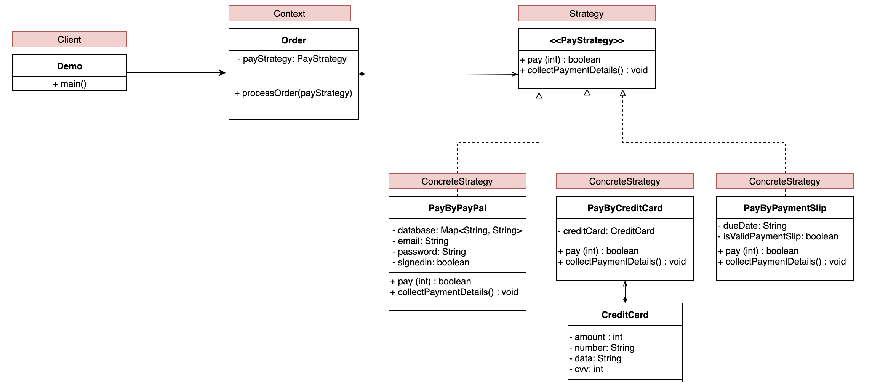

# Aplicação de exemplo usando o **padrão Strategy**

O padrão Strategy define uma familia de algoritimos, encapsula cada um e os fazem intercambiaveis.
Strategy permite que os algoritimos possam variar independente dos clientes que o usam.

# Aplicabilidade

- Quando você tiver uma classe que tem uma única resonsabilidade, porém várias maneiras de executar aquilo,
evitando os if's no código.
- Utilize o padrão Strategy quando você quer usar diferentes variantes de um algoritmo dentro de um objeto e
ser capaz de trocar de um algoritmo para outro durante a execução.

# Estrutura

Basicamente, esse padrão é composto pelo contexto, a estratégia (interface), e os comportamentos da estratégia (Implementações da interface).a
A classe original, chamada contexto, deve ter um campo para armazenar uma referência para um dessas estratégias.
O contexto delega o trabalho para um objeto estratégia ao invés de executá-lo por conta própria. o cliente passa a
estratégia desejada para o contexto. Na verdade, o contexto não sabe muito sobre as estratégias.
Ele trabalha com todas elas através de uma interface genérica, que somente expõe um único método para acionar o
algoritmo encapsulado dentro da estratégia selecionada.

**Desta forma o contexto se torna independente das estratégias concretas, então você pode adicionar novos algoritmos ou
 modificar os existentes sem modificar o código do contexto ou outras estratégias**

 